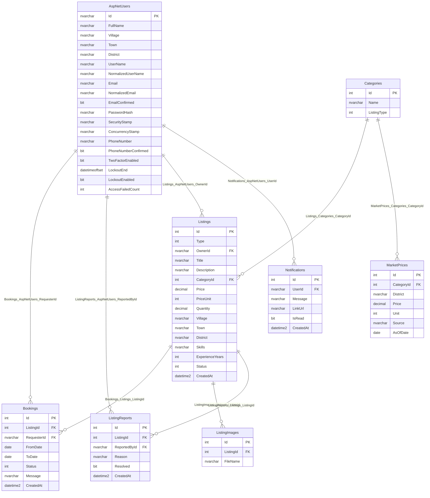

# AgriConnect - Entity Relationship Diagram

Generated from the live database schema by `tools/generate-er-diagram.sql`.
Re-run it after a migration rather than editing this file by hand.

```mermaid
erDiagram
    AspNetUsers {
        nvarchar Id PK
        nvarchar FullName
        nvarchar Village
        nvarchar Town
        nvarchar District
        nvarchar UserName
        nvarchar NormalizedUserName
        nvarchar Email
        nvarchar NormalizedEmail
        bit EmailConfirmed
        nvarchar PasswordHash
        nvarchar SecurityStamp
        nvarchar ConcurrencyStamp
        nvarchar PhoneNumber
        bit PhoneNumberConfirmed
        bit TwoFactorEnabled
        datetimeoffset LockoutEnd
        bit LockoutEnabled
        int AccessFailedCount
    }
    Bookings {
        int Id PK
        int ListingId FK
        nvarchar RequesterId FK
        date FromDate
        date ToDate
        int Status
        nvarchar Message
        datetime2 CreatedAt
    }
    Categories {
        int Id PK
        nvarchar Name
        int ListingType
    }
    ListingImages {
        int Id PK
        int ListingId FK
        nvarchar FileName
    }
    ListingReports {
        int Id PK
        int ListingId FK
        nvarchar ReportedById FK
        nvarchar Reason
        bit Resolved
        datetime2 CreatedAt
    }
    Listings {
        int Id PK
        int Type
        nvarchar OwnerId FK
        nvarchar Title
        nvarchar Description
        int CategoryId FK
        decimal Price
        int PriceUnit
        decimal Quantity
        nvarchar Village
        nvarchar Town
        nvarchar District
        nvarchar Skills
        int ExperienceYears
        int Status
        datetime2 CreatedAt
    }
    MarketPrices {
        int Id PK
        int CategoryId FK
        nvarchar District
        decimal Price
        int Unit
        nvarchar Source
        date AsOfDate
    }
    Notifications {
        int Id PK
        nvarchar UserId FK
        nvarchar Message
        nvarchar LinkUrl
        bit IsRead
        datetime2 CreatedAt
    }
    AspNetUsers ||--o{ Bookings : "Bookings_AspNetUsers_RequesterId"
    AspNetUsers ||--o{ ListingReports : "ListingReports_AspNetUsers_ReportedById"
    AspNetUsers ||--o{ Listings : "Listings_AspNetUsers_OwnerId"
    AspNetUsers ||--o{ Notifications : "Notifications_AspNetUsers_UserId"
    Categories ||--o{ Listings : "Listings_Categories_CategoryId"
    Categories ||--o{ MarketPrices : "MarketPrices_Categories_CategoryId"
    Listings ||--o{ Bookings : "Bookings_Listings_ListingId"
    Listings ||--o{ ListingImages : "ListingImages_Listings_ListingId"
    Listings ||--o{ ListingReports : "ListingReports_Listings_ListingId"
```

